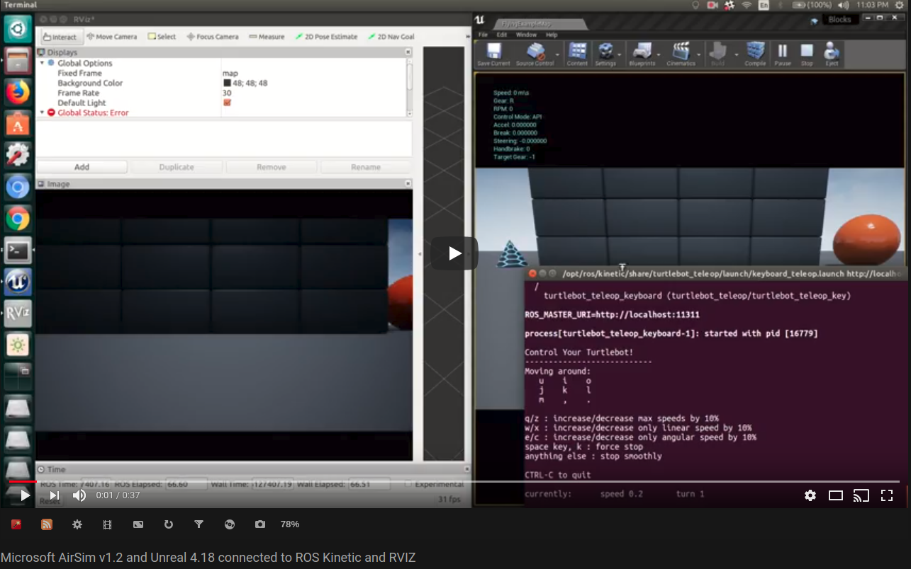

# Disclaimer
Most of the code in this repo was developed by Behzad Boroujerdian and Hasan Genc from the Department Of Electrical and Computer Engineering at The University of Texas at Austin. I put some finishing touches and wrote the guidelines below in the hope that this will be useful for others. This is supposed to be a preliminary solution while Microsoft don't provide an alternative one.

This repository is developed based on the work forked from github user: rakeshshrestha31  

# Changes
- Build Microsoft's AirSim with g++ to get it working with ROS as the client
- Modified AirSim fork can be found [in this repository](https://github.com/aravindk2604/AirSim.git).  
- `publishAirsimImgs` repository works with Unreal 4.18, AirSim v1.2 and ROS Kinetic tested on Ubuntu 16.04.
- Example c++ code to stream images from a camera on the car in AirSim to a ROS topic called **front_center/image_raw** visualized on RVIZ. This data is obtained from the `front_center` camera of a car model used in AirSim whose movements are controlled by the `teleop` code written for TurtleBot. The video below shows the demonstration of this example.  

  
[](https://youtu.be/Ubqx9WifekQ)
  
  
# Install Unreal 4.18, AirSim v1.2 (build with clang++)
I assume that you already have installed Unreal 4.18 and AirSim v1.2 built on your machine. If not, then follow the link below.
https://github.com/Microsoft/AirSim/blob/master/docs/build_linux.md  

 Please note that there is another instance of AirSim that has to be built with g++ instead of clang++ and is mentioned in the subsequent steps


# Build AirSim using g++
This is the other instance of AirSim which is my fork that can build with g++. [AirSim fork g++](https://github.com/aravindk2604/AirSim.git). Fork this repository and/or dowload it on your machine and navigate to the AirSim directory.  
```
git clone https://github.com/aravindk2604/AirSim.git
```
Henceforth we only discuss about the AirSim built with g++
Export the path of the AirSim directory as an environment variable `AIRSIM_PATH` before building the project.
  
```
export AIRSIM_PATH=~/your_work_directory/AirSim/
```

## Dependencies
- Eigen3

```
sudo apt-get install libeigen3-dev
```

- MAVROS
```
sudo apt-get install ros-kinetic-mavros ros-kinetic-mavros-extras
```
- CMAKE 3.12.1
Follow the answer posted by Teocci on Stack Exchange [link](https://askubuntu.com/questions/355565/how-do-i-install-the-latest-version-of-cmake-from-the-command-line?rq=1)

- Clang++ v3.9 or newer to support C++14

To Install it you first need the archive signature:

```
wget -O - http://apt.llvm.org/llvm-snapshot.gpg.key|sudo apt-key add -
```

If you are using Ubuntu 16.04 (Xenial) then you can simply do this:

```
sudo apt-add-repository "deb http://apt.llvm.org/xenial/ llvm-toolchain-xenial-3.9 main"
sudo apt-get update
```

For other flavors of Linux, you can get more instructions from http://apt.llvm.org/.

Then run the following:

```
sudo apt-get update
sudo apt-get install clang-3.9 clang++-3.9
```

Note: On Ubuntu 16.04 you may be missing libjsoncpp0 which is no longer available in the package manager, you can [download the relevant package here](https://packages.ubuntu.com/trusty/amd64/libjsoncpp0/download) and install with the command:

```
sudo dpkg -i libjsoncpp0_0.6.0~*.deb
```

Make clang 3.9 as the default version by the command:
```
sudo update-alternatives --install /usr/bin/clang clang /usr/bin/clang-3.9 60 --slave /usr/bin/clang++ clang++ /usr/bin/clang++-3.9
```

- Geoid Model dataset - install this package in your global packages that is common for your entire machine.
```
wget https://raw.githubusercontent.com/mavlink/mavros/master/mavros/scripts/install_geographiclib_datasets.sh

sudo chmod +x install_geographiclib_datasets.sh

./install_geographiclib_datasets.sh
```


- Copy the `publishAirsimImgs` repository into your catkin workspace

```
cd ~/catkin_ws/src/
git clone git@github.com:aravindk2604/publishAirsimImgs.git
cd ~/catkin_ws
catkin_make
```

# Run

- Run Unreal Engine 4.18
- Open Blocks simulation environment
- Run roscore in a terminal and make sure to have multiple terminal windows
```
roscore
```
- Run MAVROS
Make sure to change the *udp* parameter inside the `mavrosAirsim.launch` to have the same ip as your machine (assuming Unreal and AirSim runs on your machine)
Inside your catkin workspace where you have the `publishAirsimImgs` package
```
source devel/setup.bash
roslaunch airsim_img_publisher mavrosAirsim.launch

```
- Run pubImages.launch after changing the `Airsim_ip`'s default value to reflect your machine's ip address.

```
roslaunch airsim_img_publisher pubImages.launch
```

- Run the TurtleBot's teleop node to control the car in the AirSim environment. Note, you will need the ros-kinetic-turtlebot package for this.
```
roslaunch turtlebot_teleop keyboard_teleop.launch
```
